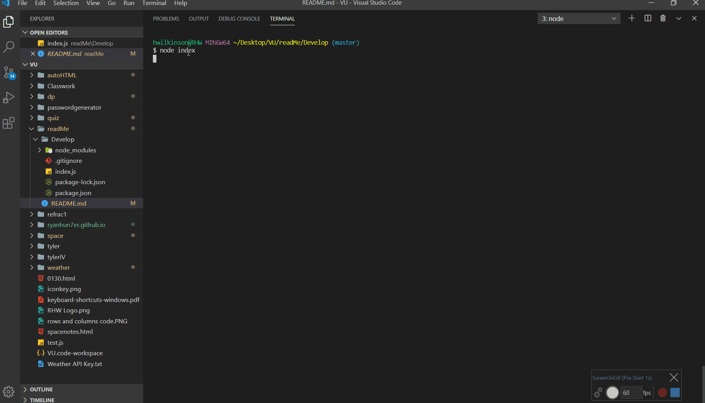

# readMe
* Create a readMe quick and easy

## Table of Contents
* 1. Test 2. Restest

## Installation
* install

## Instructions for Use
* 

## License
* MozillaPublicLicense2.0

## Contributors
* me, myself, and I

## Testing
* jest

## Contact

* @ryanhun7er

* null

* Nashville, TN

* https://github.com/ryanhun7er

